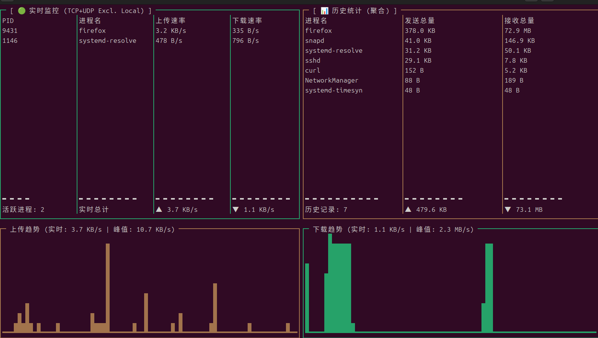

````markdown
# netmon 🌐

**netmon** 是一个基于 **eBPF** 的高性能 Linux 网络流量监控工具。它提供了一个精美的终端用户界面 (TUI)，能够实时、精准地展示**进程级**的网络带宽使用情况。

与传统的监控工具不同，`netmon` 完全在内核态进行流量统计，开销极低，并且具备智能去噪功能，能让你一眼看清到底是哪个进程在占用你的物理带宽。



> **注意**: 本项目采用 **eBPF CO-RE (Compile Once - Run Everywhere)** 技术，生成的二进制文件可直接在不同版本的 Linux 内核 (5.8+) 上运行，无需在目标机器上重新编译。

## ✨ 核心特性

* **⚡️ 内核级极速体验**: 使用 eBPF Kprobes (`tcp_sendmsg`, `udp_sendmsg` 等) 直接在内核层捕获流量，对系统性能几乎无影响。
* **🌐 双协议全覆盖**: 完美支持 **TCP** 和 **UDP** 协议（包括 DNS 查询、QUIC 视频流、游戏流量等）。
* **🧹 智能去噪 (过滤回环)**: 内核层自动过滤 Localhost (`127.0.0.1`) 流量。**你看不到 Docker 内部或本地代理的虚高流量，只展示真实的物理网卡带宽。**
* **🧵 智能线程聚合**: 自动识别并合并多线程应用（如 Firefox 的 "Socket Thread"、"DNS Resolver"）的流量，展示为一个干净的进程视图。
* **💀 全生命周期追踪**: 即使进程瞬间结束（如 `curl` 或 `dig`），其流量统计也会被完整记录并标记为 `(dead)`，绝不漏掉任何短命进程。
* **📊 专业 TUI 仪表盘**: 包含实时速率列表、历史总量榜单、以及带峰值指示的 **实心波形图**。
* **📱 响应式布局**: 界面自动适应终端窗口大小，支持小屏幕模式。

## 🛠️ 运行要求

* **操作系统**: Linux
* **内核版本**: >= 5.8 (需要支持 BTF)
* **权限**: 需要 Root 权限 (用于加载 eBPF 程序)

## 🚀 快速上手

### 方式一：直接运行 (推荐)

直接从 [Releases 页面](https://github.com/YOUR_USERNAME/netmon/releases) 下载最新版本的静态编译文件 `netmon-static`，它可以在任何现代 Linux 发行版上直接运行：

```bash
# 赋予执行权限
chmod +x netmon-static

# 运行 (需要 sudo)
sudo ./netmon-static
````

### 方式二：从源码编译 (开发者)

如果你想修改代码或自己构建，需要 Go 和 Clang 环境。

**[可选] 安装编译依赖 (以 Ubuntu/Debian 为例):**

```bash
# 安装 Clang/LLVM 和 Go 语言
sudo apt update && sudo apt install clang llvm golang-go git

# 检查 Go 版本 (要求 >= 1.20)
go version
```

*\> 注意：如果系统源里的 Go 版本过低，请参考 [Go 官方文档](https://go.dev/doc/install) 手动安装最新版。*

**开始编译:**

```bash
# 1. 生成 eBPF 字节码 (依赖 clang)
go generate

# 2. 编译 Go 程序
go build -o netmon

# 3. 运行
sudo ./netmon
```

### 方式三：自行构建便携版

如果你想在开发机上编译一个不依赖环境的二进制文件，以便分发给其他机器：

```bash
CGO_ENABLED=0 go build -ldflags "-w -s" -o netmon-static
```

## 🧩 技术架构原理

`netmon` 采用经典的 **控制平面 (User Space)** 与 **数据平面 (Kernel Space)** 分离架构：

### 1\. 内核态 (C 代码 / eBPF)

  * **挂载点**:
      * `tcp_sendmsg` / `udp_sendmsg`: 捕获发送流量，并过滤掉目的 IP 为 127.0.0.0/8 的包。
      * `tcp_cleanup_rbuf`: 捕获 TCP 接收流量。
      * `udp_recvmsg`: 使用 **Map-in-Map 上下文追踪技术**，在入口记录 Socket 信息，在出口统计接收字节数，完美解决了 UDP 无连接难以统计接收流量的痛点。
  * **CO-RE**: 引入 `vmlinux.h`，摆脱对本地内核头文件的依赖，实现跨内核版本兼容。

### 2\. 用户态 (Go 代码)

  * **数据清洗**: 每秒读取 BPF Map，对同一 PID 下的所有线程数据进行聚合。
  * **名字解析**: 采用双重策略——优先读取 `/proc/PID/comm` (权威)，读取失败则使用内核 BPF 记录的历史名字 (兜底)，确保存活和已死进程都有正确的名字。
  * **UI 渲染**: 使用 `termui` 库构建响应式 TUI，实现了嵌套网格布局和自适应图表组件。

## 📝 开源协议

MIT License

```
```
